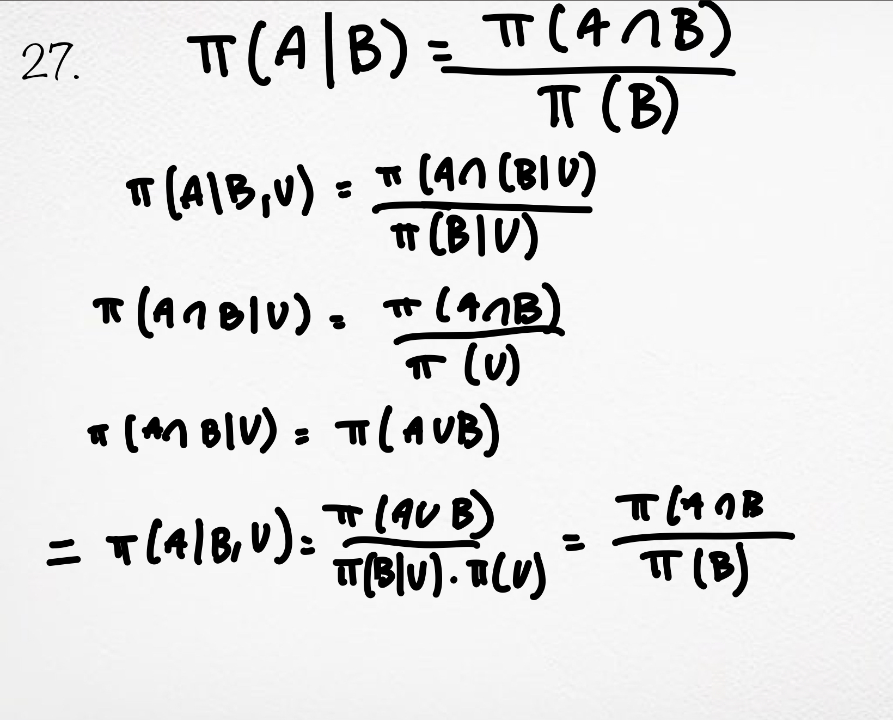
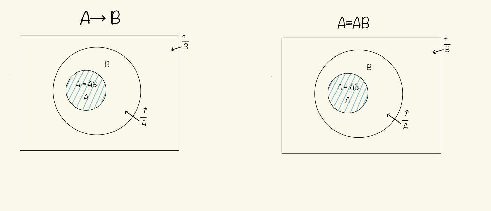

1. Observational data is what we perceive of the nature. Reality is what we will never know because it is always obfuscated with our biases and measurement uncertainties.  
2. "All data visualizations map data values into quantifiable features of the resulting
graphic." To name a few would be like color, shape, size, position, line style, and texture.  
3. The top one because it more vabiant.
4. A.
   A) Sequential: Best for representing ordered, continuous data where values increase or decrease in a linear fashion, such as temperature, elevation, or income.  
B) Diverging: Ideal for visualizing data with a meaningful midpoint, often zero, where values can be both positive and negative. This type of scale helps to emphasize deviation from a neutral value, with one color representing positive values and another representing negative values.  
C) Qualitative: Suitable for categorical data that has no inherent ordering. Each category is assigned a distinct color, making it easy to differentiate between different groups or classes.  
D) Monochromatic: Best for continuous data where you want to emphasize a smooth transition across a wide range of values, typically from low to high. This scale uses a variety of colors to represent different values, providing a perceptually uniform transition that is also colorblind-friendly.  
5. (A) Valid  
   (B) Valid  
   (C) Invalid  
   (D) Invalid  
   (E) Invalid  
   (F) Invalid
6. Theory, Experiment, Computation.
7. No. “The sky is rainy” implies that “the sky is cloudy”. However, rainy sky did not physically cause the cloudy sky.
8. (A) No, the data's "average" does not correlate with the red line.
   (B) measurement.  
   (C) yes.  
9. No.  
10. Non-negativity, Normalization, Additivy.  
11. 1 -> 1, 01 -> 1, 10 -> 2  
12. No, numbers in the real world are infinite, like pi which can go on forever, computers are limited and can mainly handle a fixed amount of digits.
13. 
14. Git is the software for version control, github is the service that uses Git.
15. Bayesian school of probabilty.
16. Bayesian school of probabilty.
17. Frequentist school of probablity.
18. The visualization's x-axis starts at a number before 0. The axis represents age and you can't have negative age.
19. Because computer operate using binary code (0s and 1s).
20. B.
21. Fortran.
22. 
23. 
24. (A) Deductive reasoning: If A is true, then B is true.  
   (B) Plausible reasoning: If A is true, then B is more likely to be true.
25. It means they have the same truth value.
26. 
27. 
28. S=1638. 99+3 = 102. (102 x 33)/2 = 1638. add the last and first term to give the total of a pair in between the summations then mulitple by the amount of numbers, then divide by 2 to in count for the pairs.
29. (A↑B)↑(A↑B) can be simplify to (AB) We know that (AB)=(A↑B)= Aˉ+ Bˉ.   
30. C = A+B, C is true when A or B is true, the negation of C is Cˉ and (A+B)ˉ = Aˉ*Bˉ. So it can be seen as Cˉ = (A+B)ˉ= Aˉ*Bˉ.  
31. 
32. (A) Quantum, Prababilistic, Measurment, Chaotic, Cosmological.  
    (B) Quantum.  

