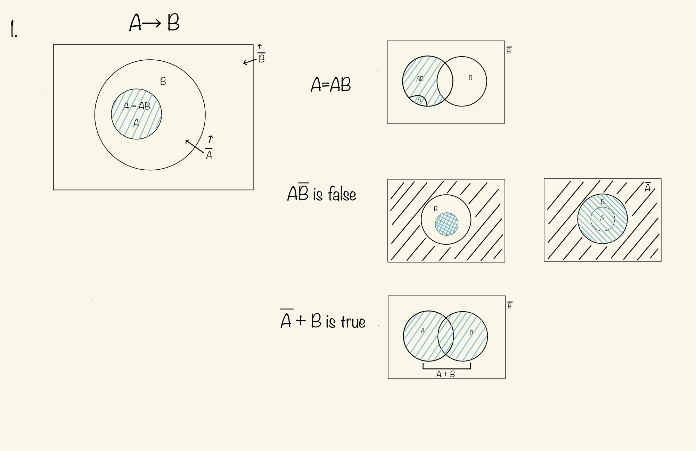
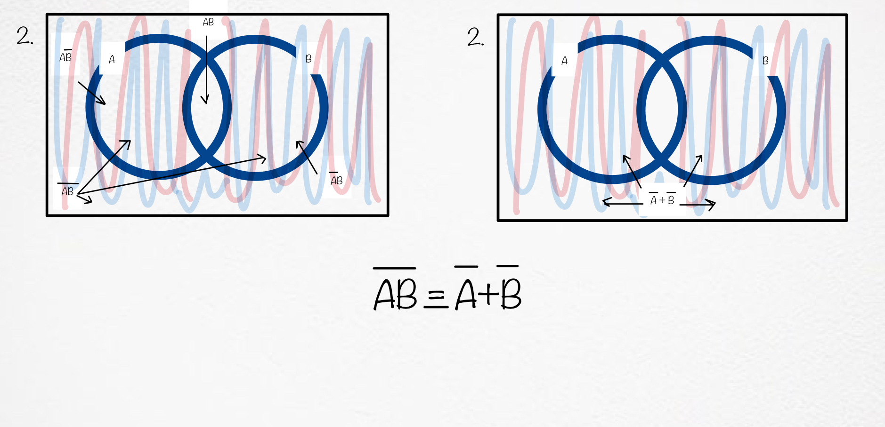
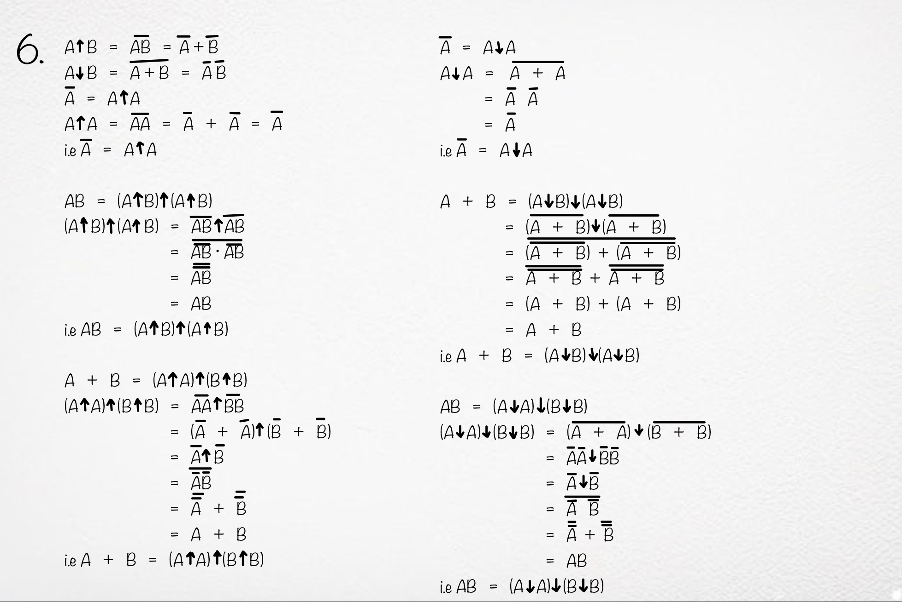
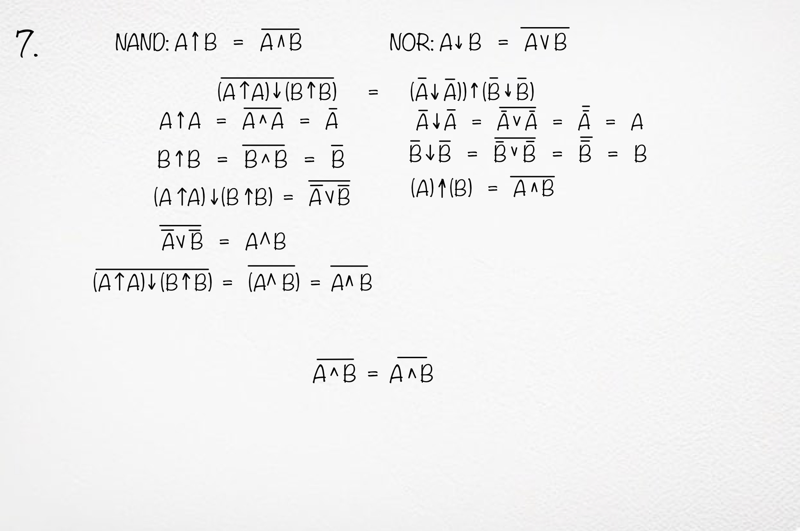
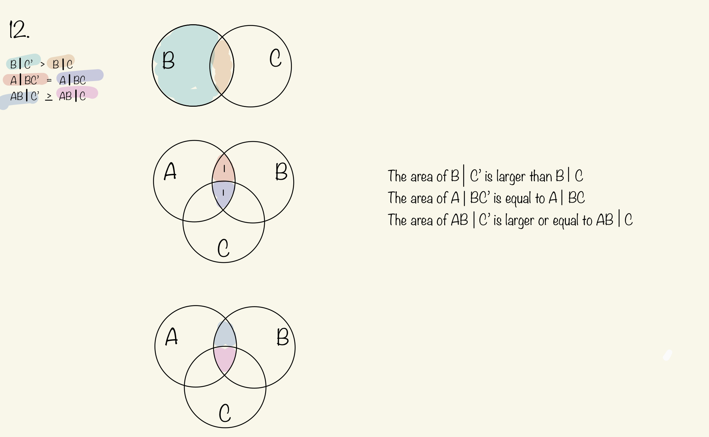

1.     
2. 
3. 
4.  
5.  
6.  
7.  
8.  
9.  
10. 
11. 
    
12.    
13. (I) Degrees of plausibility are represented by real numbers.  
    (II) Qualitative correspondence with common sense.  
    (III) Consistency.  
 
